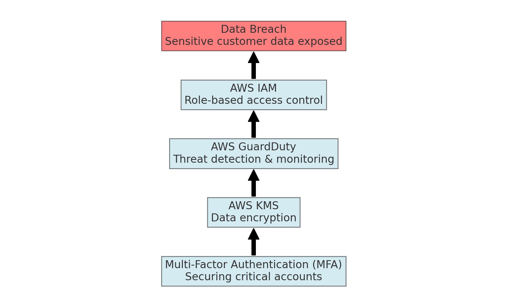
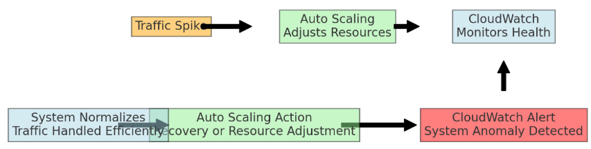

 The scenario: 
A bank manager approached an Amazon Web Services (AWS) product manager about a data leak that occurred 6 months ago. As a result of the leak, the bank lost money.

The bank manager has concluded that it’s time to make fundamental changes to the bank’s systems operations. The manager isn’t satisfied with the efficiency of the bank’s systems operators. 

The manager also has concerns about the security of sensitive customer information and the stability of the bank’s systems. The manager has lost confidence in the expertise of the SysOps team. This situation has driven the manager to approach AWS.

### 🔑 **Key Areas & Questions**:

#### 🔒 **Security**:
- “Can you tell us more about **how the breach happened** and the **security measures** that were in place at the time?”
- “Was **customer data** encrypted at rest and in transit?”
- “Are there any **existing AWS security tools** currently being used, such as **IAM**, **GuardDuty**, or **KMS**?”

#### ⚙️ **System Stability**:
- “How often does **system downtime** or **performance degradation** occur?”
- “Are there particular **services** or **applications** where you see the most issues?”
- “Have these **stability issues** been affecting **critical banking operations**?”

#### 🚀 **Efficiency**:
- “Are there any specific **SysOps processes** that are causing **significant delays** or **errors**?”
- “How is the current **incident response process** managed? Is there a need for **better automation** or **monitoring**?”
- “Is the **SysOps team** experiencing **challenges with AWS tools**, or is there a skills gap?”

#### 🎯 **Future Expectations**:
- “What would a **successful resolution** look like for you?”
- “Is the goal primarily to improve **security**, **stability**, or **efficiency**, or a combination of all?”
- “Would you prefer a **long-term AWS partnership**, or are you looking for a more **specific short-term solution**?”

These questions, coupled with the right AWS services, will help you align the bank’s needs with tailored solutions.

### 🎯 **Objective**: Understand the bank manager’s key concerns, clarify expectations, and gather relevant information for proposing a solution.

---

### 🔑 **Key Areas to Focus On**:

#### 1. **🔒 Security**:
- **What specific security breaches occurred?**
- **How was customer data leaked, and what type of data was exposed?** (e.g., financial details, personal information)
- **Are there any current AWS security tools or features in use** (e.g., **IAM**, **encryption**, **AWS Shield**)? 
- **Has there been a security audit or vulnerability scan since the breach?**

#### 2. **⚙️ System Stability**:
- **What are the main pain points regarding system instability?** (e.g., latency, system crashes, unresponsive services)
- **How often do outages or performance issues occur?**
- **Are these issues related to specific AWS services or internal infrastructure?**
- **Is system downtime affecting any critical banking operations?**

#### 3. **🚀 Efficiency of System Operations**:
- **What specific inefficiencies are present in the current system operations?**
- **Is the SysOps team lacking the necessary AWS knowledge or tools?** (e.g., automation, monitoring)
- **What areas of automation are currently implemented, and what’s missing?**
- **How are incidents currently handled by the SysOps team, and how long does resolution typically take?**

#### 4. **💼 Business Impact**:
- **What has been the financial and reputational impact of the data leak?**
- **Are there any legal or compliance implications resulting from the breach?**
- **How critical is the system for daily bank operations?**
- **Has the bank lost customers or market share due to this incident?**

#### 5. **🎯 Goals and Expectations**:
- **What are the manager's main priorities in addressing these issues?** (e.g., **security**, **stability**, or **efficiency**)
- **Does the manager expect a long-term AWS partnership or specific services?**
- **Is the manager open to a complete AWS-managed service, or is the preference to upskill the internal team?**
- **What is the bank’s risk tolerance for future potential incidents?**

---

### 📋 **Preparation Checklist**:

#### **🔍 Probing Questions**:
- Prepare a mix of **open-ended questions** and **targeted follow-ups** for each area of concern (e.g., "Can you describe the timeline of the data breach?" "What efforts have been made to address system inefficiencies?")
  
#### **👥 Assign Roles**:
1. **Security Expert**: Lead questions on breaches, current security posture, and AWS security tools (e.g., IAM, encryption, GuardDuty).
2. **Ops Expert**: Focus on system operations, automation tools, and efficiency concerns.
3. **General AWS Consultant**: Gather business objectives, long-term goals, and partnership expectations.

#### **📘 Prepare Notes** on Key AWS Services:
- **AWS CloudTrail**: Tracks user activity and API usage for auditing.
- **AWS Config**: Monitors and evaluates configurations across AWS resources.
- **AWS Shield**: Provides DDoS protection.
- **AWS GuardDuty**: Detects security threats using machine learning.
- **AWS Trusted Advisor**: Offers insights on best practices for security, cost, and performance optimization.

---

By focusing on these key areas and assigning roles effectively, you can ensure that the meeting with the bank manager is productive and that you gather the necessary information to propose the best solution.

Here's a security flowchart illustrating how AWS solutions can prevent a future data breach:

1. **Data Breach**: The initial problem where sensitive customer data was exposed.
2. **AWS IAM**: Implement role-based access control to limit access to sensitive information.
3. **AWS GuardDuty**: Use real-time threat detection and continuous monitoring to identify malicious activity.
4. **AWS KMS**: Encrypt sensitive customer data using AWS Key Management Service (KMS) to protect it from unauthorized access.
5. **Multi-Factor Authentication (MFA)**: Add an extra layer of security to critical user accounts.

# System Stability Diagram

This flow represents how the combination of these AWS tools can prevent future breaches and enhance overall security.

# Solution

1. Introduction: 📝
Purpose: This presentation addresses the bank's concerns regarding:
Security vulnerabilities 🔓
System instability ⚠️
Operational inefficiency 🚧
Our goal is to propose AWS solutions that will enhance security, improve system stability, and boost operational efficiency.
2. Problem Overview ⚙️
Key Issues:
Security Vulnerabilities: A data breach occurred 6 months ago, leading to the exposure of sensitive customer information 📉.
System Instability: The bank experiences frequent outages and performance issues 🚨.
Operational Inefficiency: The SysOps team lacks sufficient AWS expertise, impacting operational efficiency 🛠️.
3. Proposed Solutions 🔧
Security 🛡️:

AWS Identity and Access Management (IAM): Implement robust role-based access control for enhanced security 🧑‍💼.
Amazon GuardDuty: Enable real-time threat detection and continuous monitoring of the environment 👁️‍🗨️.
AWS Key Management Service (KMS): Encrypt all sensitive customer data to protect against unauthorized access 🔐.
Multi-Factor Authentication (MFA): Add an extra layer of security for critical user accounts 🔑.
System Stability 🚀:

Auto Scaling: Automatically scale resources based on demand, ensuring consistent performance even during traffic spikes 📈.
Amazon CloudWatch: Set up real-time performance monitoring and proactive alerts to maintain system health 🔍.
AWS Elastic Load Balancing: Distribute incoming traffic efficiently across multiple resources to avoid downtime 📡.
Operational Efficiency 🧠:

AWS Lambda: Automate routine operations with serverless architecture, reducing manual effort 🤖.
AWS Systems Manager: Centralize data and manage systems at scale, simplifying operations from a single dashboard 🖥️.
AWS Training: Provide tailored training programs to upskill the SysOps team in best AWS practices 🎓.
4. Benefits 🌟
Enhanced Security:

Data protection through encryption and access control 🚪.
Real-time threat monitoring and alerting ⚠️.
Improved Stability:

Automatically scale resources to handle increased demand 📊.
Proactive system health monitoring and traffic distribution 🏗️.
Optimized Operations:

Reduced manual effort through automation ⚙️.
Centralized operations management 🗂️.
Improved SysOps team efficiency with AWS training 👩‍🏫.
Long-term Cost Savings:

Minimizing the likelihood of future data breaches and outages 💰.
Reducing operational overhead with automation 🧑‍💻.
5. Conclusion 🎯
Recap:
We propose implementing a comprehensive solution that addresses the bank’s concerns around security, system stability, and operational efficiency.
AWS tools such as IAM, GuardDuty, Auto Scaling, CloudWatch, and Lambda will provide the robust, scalable, and secure infrastructure the bank needs to regain stability and protect customer data.
Confidence:
With AWS’s powerful suite of tools, the bank will not only improve system performance and security but also foster long-term operational efficiency. 🔒💻📊
