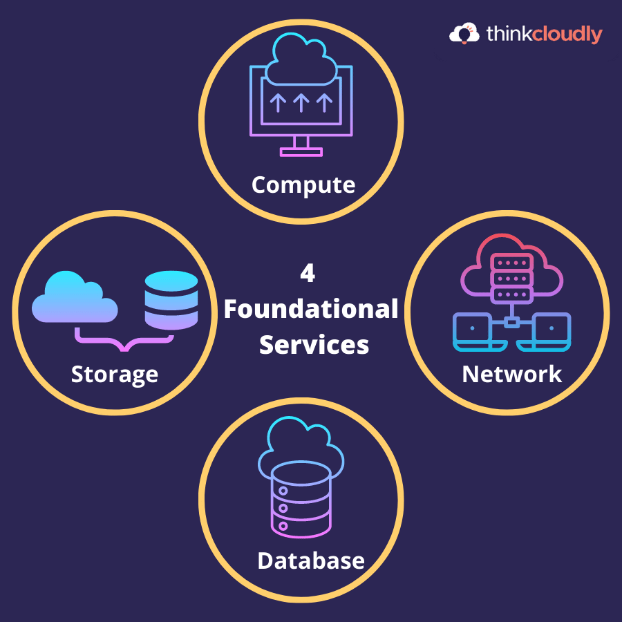

**AWS Cloud Foundations –Two fact finding exercise** 
1.Explain the AWS Shared responsibility model.
2.Explain an AWS Identity and Access Management (IAM) Role.
3.Explain an AWS Identity and Access Management (IAM) Policy.
4.Describe an Amazon Machine Image (AMI).
5.List the different Amazon EC2 instance types with use cases for each type.
6.Explain Amazon Virtual Private Cloud (VPC).
7.Differentiate between a Publicand a Privatesubnet

**1. Explain the AWS Shared Responsibility Model:**
The AWS Shared Responsibility Model 🛡️ divides security and compliance responsibilities between AWS and the customer:

AWS Responsibility (Security of the Cloud):
AWS is responsible for protecting the infrastructure that runs all the services (⚙️ hardware, 🖥️ software, 🌐 networking, and 🏢 facilities). AWS handles physical security and the core infrastructure.

Customer Responsibility (Security in the Cloud):
Customers are responsible for securing the data they put in the cloud, managing identities and access 🔑, ensuring encryption 🔐, and configuring network settings 🌍.

**2. Explain an AWS Identity and Access Management (IAM) Role:**
An IAM Role 🎭 is a set of permissions that define what actions are allowed or denied for an AWS service or resource. Unlike IAM users, roles do not have passwords or keys and are meant to be assumed by trusted entities (like applications or services).

👉 Use case: An EC2 instance assumes an IAM role to access an S3 bucket 📦, ensuring security without hard-coding credentials.

**3. Explain an AWS Identity and Access Management (IAM) Policy:**
An IAM Policy 📜 is a document that specifies permissions for actions on AWS resources. Policies are written in JSON format and include permissions like Allow or Deny for specific actions like s3:PutObject on resources like an S3 bucket.

👉 Example: A policy may allow a user to have read-only access to an S3 bucket 👓, ensuring secure access.

**4. Describe an Amazon Machine Image (AMI):**
An Amazon Machine Image (AMI) 📀 is a template that contains the software configuration (operating system, application server, and apps) necessary to launch EC2 instances. You can use AMIs to create new instances with pre-configured environments.

👉 Use case: Quickly launch new web servers 🌐 or application instances 🖥️ without setting everything up from scratch.

**5. List the different Amazon EC2 instance types with use cases for each type:**
General Purpose (e.g., t3, m5) 💻:
Balanced compute, memory, and networking.
Use case: Web servers, dev/test environments.

Compute Optimized (e.g., c5, c6g) 🖥️:
Optimized for compute-intensive workloads.
Use case: High-performance computing (HPC), batch processing.

Memory Optimized (e.g., r5, x1e) 🧠:
Optimized for memory-heavy workloads.
Use case: In-memory databases, big data analytics.

Storage Optimized (e.g., i3, d2) 💾:
Designed for storage-heavy tasks.
Use case: NoSQL databases, data warehousing.

Accelerated Computing (e.g., p4, g4) 🚀:
Provides hardware acceleration with GPUs.
Use case: Machine learning 🤖, AI, and video rendering 🎥.

**6. Explain Amazon Virtual Private Cloud (VPC):**
An Amazon Virtual Private Cloud (VPC) 🌐 is a virtual network that allows you to create a private, isolated environment for your AWS resources. You control the IP ranges, subnets, routing, and security settings. VPCs provide secure communication for your cloud services 🛡️.

Key components of a VPC include:

Subnets (Public and Private) 🏢
Route Tables 🛣️
Internet Gateways 🌍
NAT Gateways 🔒
**7. Differentiate between a Public and a Private Subnet:**
Public Subnet 🌐:
Connected to the internet through an Internet Gateway, allowing resources like EC2 instances to be accessed from the internet (with public IPs).

👉 Use case: Hosting web servers 🖥️ that need public access.

Private Subnet 🔒:
Not directly accessible from the internet. Resources here don’t have public IPs and are accessed through NAT gateways or VPNs.

👉 Use case: Hosting databases 📊 or sensitive services that shouldn’t be exposed to the public internet.

