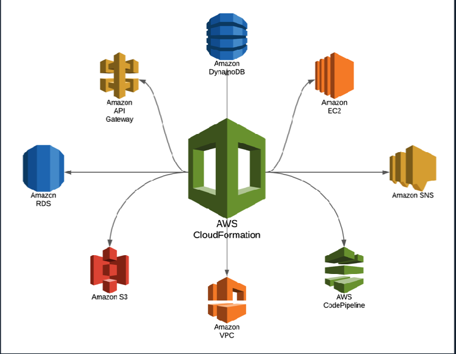

AWS CloudFormation fact finding exercise 
**1.What is Configuration Orchestration?**
**2.What is Configuration Management? List some commonly used tools for Configuration Management.**
**3.What is Continuous Integration?**
**4.What is Continuous Delivery?**
**5.What is AWS CloudFormation? List 3 advantages of CloudFormation.**
**6.What is JSONand YAML? List 3 differences between them.**
**7.What is a stackin AWS CloudFormation?**

### 1. **What is Configuration Orchestration?** 🚀
   - Configuration Orchestration is the **automated coordination and management** of complex computer systems, software, and infrastructure components. It ensures all resources work together smoothly by automating tasks like setting up servers, databases, and network configurations, especially useful in cloud environments.

---

### 2. **What is Configuration Management?** 🛠️
   - Configuration Management is the **process of maintaining system consistency** by managing, tracking, and updating configurations across software and hardware.
   - **Common Configuration Management Tools:**
     - **Ansible** 🌐
     - **Puppet** 🤖
     - **Chef** 👨‍🍳
     - **SaltStack** 🧂

---

### 3. **What is Continuous Integration?** 🔄
   - Continuous Integration (CI) is a development practice where developers **frequently integrate code into a shared repository**, typically multiple times a day. Automated tests are run to detect issues early, reducing integration problems and ensuring the software remains functional.

---

### 4. **What is Continuous Delivery?** 🚚
   - Continuous Delivery (CD) is the process of ensuring code is **always ready to be deployed** to production. It automates code deployment to testing and staging environments, allowing for reliable releases with minimal human intervention.

---

### 5. **What is AWS CloudFormation?** ☁️
   - AWS CloudFormation is an **Infrastructure as Code (IaC) tool** that enables users to define and provision AWS infrastructure using code. This automation allows for efficient, repeatable, and scalable setups.
   - **Advantages of CloudFormation:**
     1. **Automation** 🤖: Automates provisioning and configuration, reducing manual setup.
     2. **Consistency** 🔄: Ensures uniformity across environments by reusing templates.
     3. **Cost Efficiency** 💰: Eliminates resource waste through quick, controlled provisioning.

---

### 6. **What is JSON and YAML?** 📄
   - **JSON** (JavaScript Object Notation) and **YAML** (YAML Ain't Markup Language) are data serialization formats used to write configuration files.
   - **Differences between JSON and YAML:**
     1. **Syntax Complexity** 📏: JSON uses brackets `{}`, whereas YAML uses indentation, making YAML more readable.
     2. **File Size** 📂: YAML files are generally more concise due to less required syntax.
     3. **Comments** 💬: YAML supports comments (`#`), while JSON does not, making YAML more flexible for documenting configurations.

---

### 7. **What is a Stack in AWS CloudFormation?** 🥞
   - A **stack** in AWS CloudFormation is a **collection of AWS resources** managed as a single unit. Using a stack allows users to create, update, and delete related resources together, streamlining infrastructure management and promoting repeatability.

--- 

