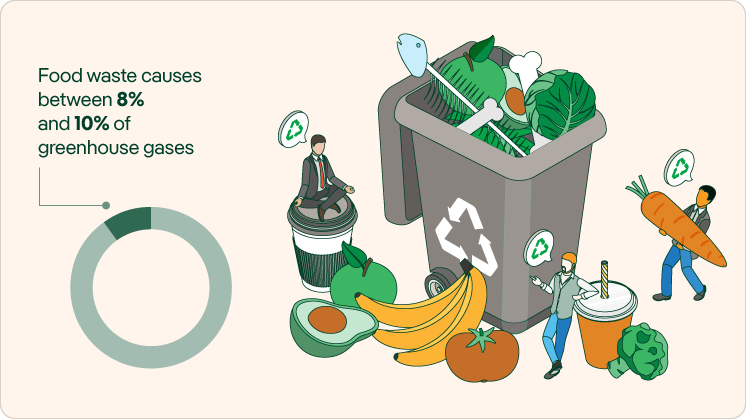
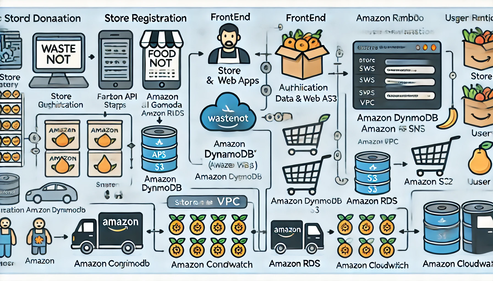
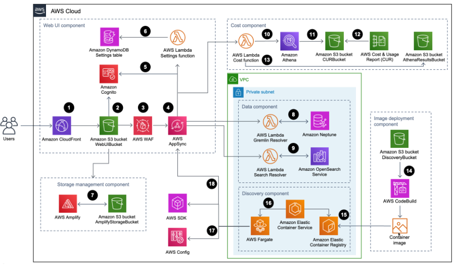

https://www.bbc.co.uk/news/topics/cr58gnj8zzxt

### **WasteNot: Problem and Opportunity Analysis (UK-based)** 🇬🇧

#### **1. What is the problem or opportunity?**
The problem is food waste and hunger coexisting in communities across the UK. Retailers, particularly those selling perishable items like supermarkets 🏪, often throw away food nearing its expiration date despite it still being safe and edible 🥑🍞. At the same time, millions of people across the UK struggle with food insecurity. 

**Opportunity**: WasteNot provides a solution by offering a platform that connects retailers with surplus perishable food to individuals and charities in need. This not only reduces waste ♻️ but also helps feed local communities 🍽️. 

#### **2. What measure shows that the problem is real?**
- **Food Waste in the UK**: According to WRAP (Waste and Resources Action Programme), the UK throws away around **9.5 million tonnes of food annually**, of which 70% is still edible 🍅🥬. 
- **Food Insecurity in the UK**: More than 4 million people in the UK, including 1.7 million children, face food insecurity, as per the Food Foundation.

These figures clearly show that food waste and hunger are significant problems that need urgent attention. WasteNot can play a vital role in addressing these issues locally.

#### **3. What would you measure to prove that you resolved the problem, and how would you measure it?**
To demonstrate WasteNot's impact, we would track the following:
- **Reduction in Food Waste**: The total weight (in tonnes) of food rescued from going to landfill and redistributed.
- **Number of Meals Provided**: Estimate the number of meals 🍽️ based on the weight and type of food donated through the platform.
- **Community Engagement**: The number of stores, charities, and individuals actively using the platform.
- **Cost Savings for Retailers**: Track how much participating stores save on waste disposal and other operational costs through food donations.

These metrics can be tracked using built-in analytics within the app 📊, which can generate detailed reports for both stores and WasteNot administrators.

#### **4. What is the cause of the problem?**
- **Retail Habits**: UK supermarkets and stores are often required to dispose of food that is close to its "best before" or "use by" date due to health regulations, even if it's still edible.
- **Limited Redistribution Channels**: Many stores lack a streamlined process for donating surplus food to local charities or food banks.
- **Food Insecurity**: Low-income households and individuals across the UK frequently face challenges in accessing nutritious food, even though local stores are throwing away surplus produce.

#### **5. How will the business measure that the solution meets the goals of the business?**
WasteNot will measure its success by monitoring:
- **Waste Reduction**: The total amount of food (in tonnes) diverted from landfill through donations.
- **Community Engagement**: The number of active users, including UK-based retailers, charities, and individuals benefiting from the platform.
- **Environmental Impact**: Reduced carbon footprint 🌍 due to decreased food waste and reduced greenhouse gas emissions from food decomposition in landfills. WasteNot will quantify this in terms of CO₂ emissions saved.
- **Feedback from Users**: Regular feedback surveys 📋 from both retailers and community members to ensure ease of use and satisfaction.
- **Financial Impact**: Track cost reductions for UK retailers by reducing food waste disposal fees and any potential revenue streams, such as premium memberships or sponsorships.

#### **6. Specify a product design to satisfy the requirements.**
The **WasteNot app** will be designed with the following key features:
- **User-friendly Interface for Retailers** 🛒: UK-based stores can quickly upload available surplus food, set pickup windows 🕒, and track donations easily through a clean dashboard.
- **Real-time Availability for Users** 📲: Individuals and charities can browse available food items in real-time, filter by categories (e.g., fruits, vegetables, bread 🍞🍓), and book items for collection.
- **Local Search** 🔍: The app will provide location-based services, ensuring users find food donations closest to them, reducing travel and logistics costs.
- **Data Analytics and Reporting** 📊: Real-time tracking of food donations, waste saved, meals served, and environmental impact (e.g., CO₂ reductions) will be available for stores and app administrators.
- **Gamification Features** 🎮: Stores can earn badges or incentives based on how much food they donate, encouraging more businesses to participate and improve their sustainability efforts.

This design ensures that **WasteNot** aligns with the goals of reducing food waste, helping those in need, and promoting sustainability throughout the UK.

Here's an enhanced version of the AWS architecture for the **WasteNot App**, complete with emojis and an overview diagram description:

### **AWS Architecture for WasteNot App** 🛠️🍽️♻️

#### **1. Frontend: Web & Mobile Application** 🌐📱
- **Amazon CloudFront** 🌍: A content delivery network (CDN) ensuring fast access to static assets like images and code across the UK.
- **Amazon S3** 🗂️: Used for storing static files such as images, CSS, and HTML for the web app.

#### **2. Backend: API and Business Logic** 💻
- **Amazon API Gateway** 🔌: Acts as the entry point for all API requests, connecting the app to backend services.
- **AWS Lambda** ⚙️: Serverless compute service to handle functions like uploading food data, retrieving available food items, and managing sessions.
- **Amazon EC2** 🖥️ (Optional): For heavier custom tasks, such as image processing or running machine learning models.

#### **3. Database & Storage** 💾
- **Amazon RDS** 🗃️: Stores structured data like user profiles, food items, and donation history.
- **Amazon DynamoDB** 🗂️: For fast access to unstructured or real-time data like user sessions.
- **Amazon S3** 🖼️: For uploading and storing images of food posted by stores.

#### **4. Authentication & User Management** 👥
- **Amazon Cognito** 🔐: Manages user authentication, sign-up/sign-in, and access control. Supports third-party providers like Google for social logins.

#### **5. Notifications and Communication** 📢
- **Amazon SNS** 🔔: Sends notifications to users about available food items near them.
- **Amazon SES** ✉️: Sends emails for updates, pickup reminders, or new food postings.

#### **6. Monitoring & Logging** 📊
- **Amazon CloudWatch** 🕵️: Monitors app performance, such as API latency or Lambda function errors.
- **AWS X-Ray** 🔍: Tracks the performance of requests, helping identify bottlenecks.

#### **7. Security** 🛡️
- **AWS WAF** 🧱: Protects the app from attacks like SQL injection or DDoS.
- **AWS Shield** 🛡️: Provides DDoS protection to keep the app available during high-traffic times.

#### **8. Data Backup and High Availability** 📈
- **Amazon RDS Multi-AZ** 🌐: Ensures high availability with automatic failover across availability zones.
- **Amazon S3 Cross-Region Replication** 🔄: Ensures critical data is backed up across different AWS regions.

#### **9. Scaling** 📏
- **AWS Auto Scaling** 🔄: Automatically adjusts EC2 instances to handle increased traffic during peak times.
- **AWS Lambda Auto Scaling** 🌱: Automatically scales up based on event-driven demand, ensuring efficient resource usage.

---


### **Diagram Description** 🖼️

1. **Frontend (Web & Mobile App)**:
   - Users access the app via **Amazon CloudFront** (CDN), which retrieves content from **Amazon S3** (static files).
   
2. **API & Backend**:
   - User requests go through **Amazon API Gateway** to reach the serverless **AWS Lambda** functions.
   - For heavy processes, EC2 instances can be spun up.

3. **Databases**:
   - Structured data is stored in **Amazon RDS** while real-time or unstructured data is stored in **Amazon DynamoDB**.
   - Food images and other media are stored in **Amazon S3**.

4. **User Authentication**:
   - Users authenticate via **Amazon Cognito** for secure access.

5. **Notifications**:
   - **Amazon SNS** handles push notifications to users, while **Amazon SES** manages email alerts.

6. **Security & Monitoring**:
   - **AWS WAF** and **AWS Shield** protect the app, while **Amazon CloudWatch** and **AWS X-Ray** monitor and log performance metrics.

7. **Scaling & Availability**:
   - Auto Scaling ensures the app scales according to traffic and usage, keeping it performant during high-demand periods.

---


### Example Diagram:

Imagine the architecture as an interconnected flow of components:

```
Users (Mobile/Web) 🌐 → CloudFront 🌍 → API Gateway 🔌 → Lambda ⚙️ → Databases (RDS 🗃️ / DynamoDB 🗂️) → Storage (S3 🖼️)
⬆️                                              
Authentication via Cognito 🔐 → Notification via SNS 📢 / SES ✉️
⬆️                                             
Security via WAF 🧱 and Shield 🛡️ | Monitoring via CloudWatch 📊 and X-Ray 🔍
⬆️                                             
Scaling via Auto Scaling 🔄
```

This architecture ensures a secure, scalable, and efficient platform for WasteNot to help the UK reduce food waste and support communities in need.