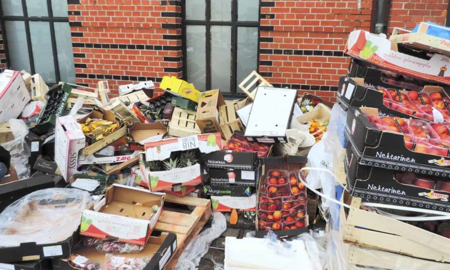
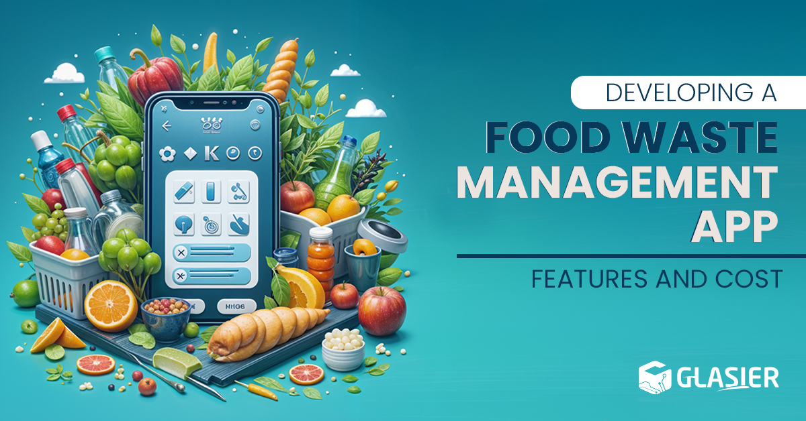
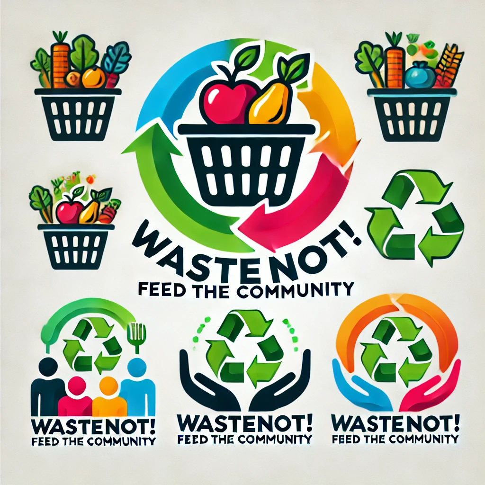

**FOR IMMEDIATE RELEASE**  
📞 Contact: WasteNot Team  
📧 Email: team@wastenot.com  
📱 Phone: + 44 11 22 33 44  
📅 Date: 11-10-2024

---

### 🍎🥖 **Introducing WasteNot: A Community-Driven Solution to Reduce Food Waste and Feed Those in Need** 🥕🍞

**London, United Kingdom** — WasteNot, a new mobile app 🆕📲 designed to connect local stores with surplus perishable items 🥗🍲 to community members in need, launches today with a mission to fight food waste ♻️ and hunger 🍽️ simultaneously. WasteNot provides an easy-to-use platform for retailers 🏪 to donate items approaching their expiration date, ensuring that good food 🥑🥛 is put to use instead of being discarded.

### **Empowering Stores and Strengthening Communities** 🏘️

Every year, millions of pounds of perfectly edible food 🍎🥦 are thrown away by supermarkets, grocery stores, and restaurants simply because they are nearing their expiration date ⏳. WasteNot aims to change that by allowing stores to give back to their communities ❤️. Participating retailers can quickly list perishable items on the WasteNot app, making them available to individuals and charitable organizations who can pick them up for free.

> “With WasteNot, we’re making it easy for stores to play an active role in reducing food waste while also providing support to those who need it most,” said WasteNot, Founder and CEO of WasteNot. “Our goal is to create a sustainable solution 🌿 that benefits both businesses and the community. No food should be wasted when there are people in need.”

---

### **How It Works** 🛠️

WasteNot simplifies the process for both stores and users:

- **For Retailers** 🏬: Stores with surplus perishable items can upload their listings 📲 to the app, specifying the items available 🥬🍞, pickup windows 🕒, and their location 📍. WasteNot enables them to easily donate food they would otherwise throw away.
  
- **For Community Members** 👨‍👩‍👧‍👦: Individuals, non-profits, and food banks can browse available items in real-time ⏱️, claim what they need ✅, and arrange for pickup at their convenience 🚗. Whether it’s fresh produce 🥦, baked goods 🥖, or prepared meals 🍲, WasteNot helps put food in the hands of those who can use it.

---

### **Fighting Food Waste, One Donation at a Time** ♻️🍽️

Food waste is a growing global issue 🌍, with estimates showing that nearly 30-40% of the food supply in the U.K. is wasted 🚯. WasteNot is designed to address this problem on a local level, creating a community-driven ecosystem that encourages sustainable practices 🌱, reduces environmental impact 🏞️, and tackles food insecurity 🤝.

> “Our vision for WasteNot is to build stronger, more resilient communities 💪,” said WasteNot. “By helping businesses redistribute surplus food and ensuring it doesn’t go to waste 🚮, we’re providing real solutions to hunger and waste reduction.”

---

### **Get Involved Today!** 🚀

WasteNot is available for download on [App Store/Google Play] 📲 starting today! Stores and restaurants are encouraged to sign up and start donating immediately. Individuals and non-profits can join the platform to see what surplus food is available in their area 🗺️ and claim what they need.

For more information, visit [WasteNot Website] 🌐 or download the app from [App Store/Google Play].

---

### **About WasteNot**  
**WasteNot** is a mobile app dedicated to reducing food waste 🌾 and hunger 🍽️ by connecting stores with surplus perishable items 🛒 to people in need. Founded in 2024, WasteNot’s mission is to ensure that good food never goes to waste ❌🥦 and always finds its way to someone who can benefit from it.

---

### **Media Contact** 📞  
**WesteNot Team**   
📧 team@wastenot.com  
📱 + 44 11 22 33 44  
🌐 WasteNot.com

--- 

# WasteNot! Feed the Community 